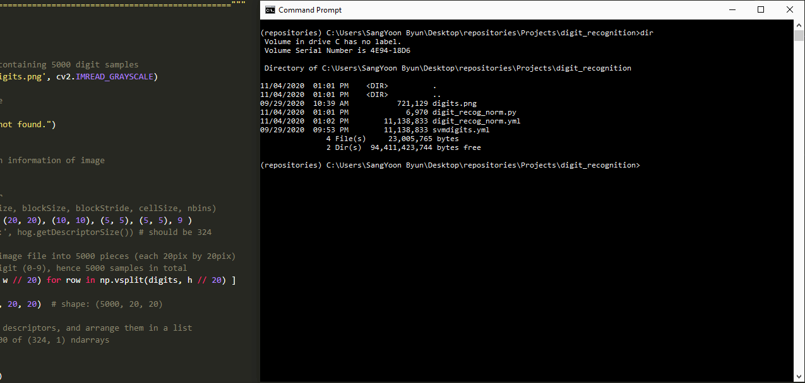
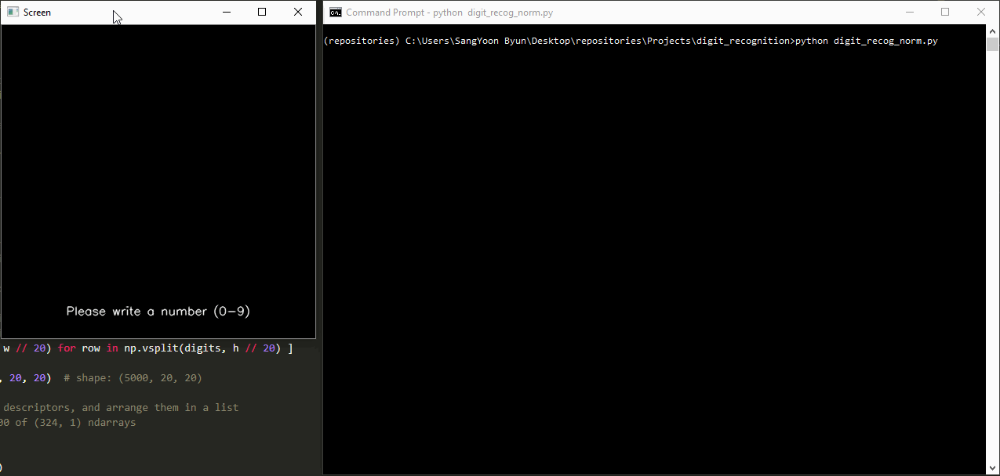

# digit-recognition

## Description

Digit-recognition is a simple program capable of accurately recognizing a digit (0-9) handwritten by a user on the screen provided. It uses HOG (Histogram of Oriented Gradients) feature descriptors and SVM (Support Vector Machine) model to identify certain features of a digit and determine the digit based on the SVM-trained data. A user can write the digit on the screen with a cursor and press the space bar to submit to the program.

The objective of digit-recognition was to learn more in-depth about how HOG feature descriptors work as well as to use the SVM model provided by OpenCV. I used the data from [OpenCV Sample Data](https://github.com/opencv/opencv/blob/master/samples/data/digits.png), which contains 5000 handwritten digit samples (500 samples for each digit). With each digit as a window of 20x20 pixels, I decided use cell size of 5x5 pixels, block size of 10x10 pixels, and block stride of 5x5 pixels. We know that each cell contains vectors of 9 bins (0, 20, 40, ..., 160 unsigned gradients), and this means that each block contains 4 x 9 = 36 bins. As each block strides 5 pixels horizontally and vertically through a window, it can slide 9 times. Therefore, we can conclude that each window (which is one digit sample) can have 9 x 36 = 324 bins. Read more about HOG Descriptors [here](https://www.learnopencv.com/histogram-of-oriented-gradients/).

We now reshape all the 9x36 vectors into 1x324 pixels, meaning that each digit can be represented as vector of a single row. We combine all 5000 digit samples together to end up with 5000x324 pixels data. This reshaped data is labelled and finally used to train the SVM model. Now, as users submit their handwritten digits, the program will compute the HOG descriptors of the submitted digit and use the trained SVM model to determine the number.

Additionally, I decided to normalize the user-input digit before performing any computations to improve the accuracy of the program. the normalization process involves finding image moments, calculating the centroid of the image, and warping the image so that the written digit is placed at the center of the image.

## Installation

I used the OpenCV package for python (version 4.1.0.25 or above) with Python 3.7.2

```bash
pip install opencv-python==4.1.0.25
```

## Usage

Clone the digit-recognition repository in your directory.

```bash
git clone https://github.com/byunsy/digit-recognition.git
```

Move to your specific directory and execute the program.

```bash
python digit_recog_norm.py
```

## Demonstrations

The program accurately recognizes all digits.



Normalization process helps the program recognize digits written off the center (near the edges).


